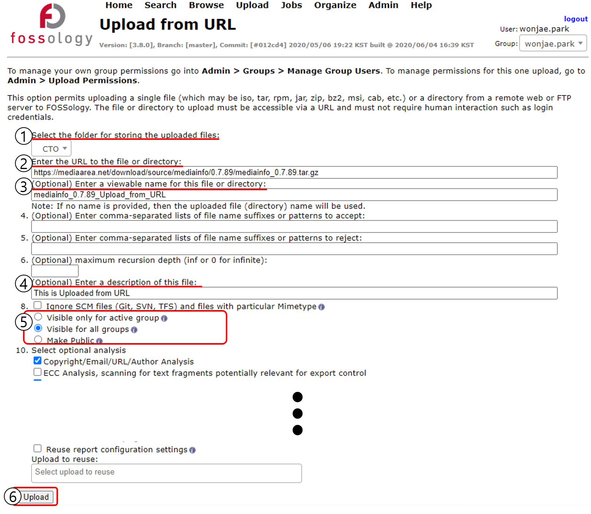
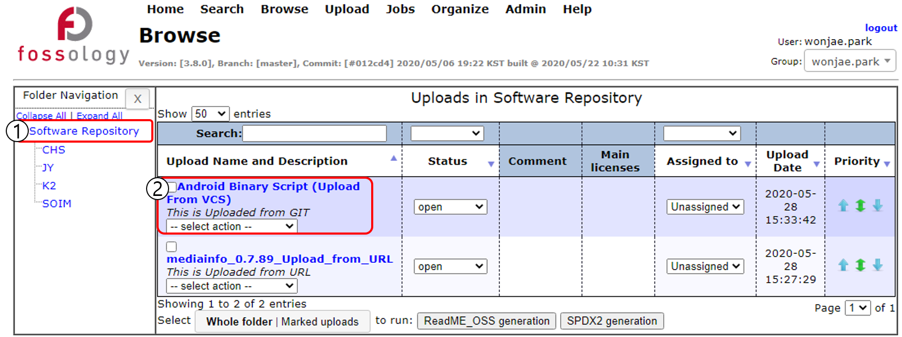
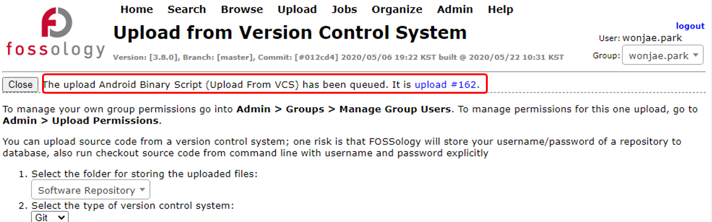
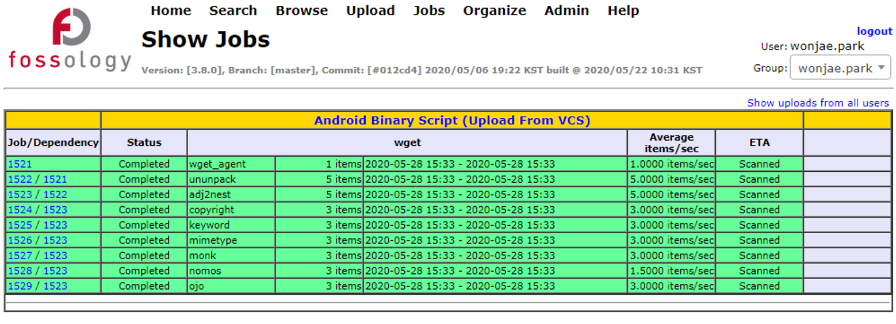

# OSS 업로드

## OSS 업로드 및 Scan

```note
FOSSology에서는 Local File, URL의 File, Version Control System의 File을 upload 할 수 있습니다.
```



1. Upload 될 folder를 지정합니다.
2. 분석할 Source의 위치를 기입합니다.
  - 선택한 메뉴에 따라 Local File, Web 상의 File, VCS(git/svn) 주소를 사용할 수 있습니다.
3. (Optional) FOSSology 시스템에서 보이는 Project의 이름을 기입합니다.
  - Upload from File에서는 파일명이 사용됩니다.
4. (Optional) FOSSology 시스템에서 보이는 Project의 설명을 기입합니다.
5. Project 접근 권한을 설정합니다.
  - Admin > Groups > Manage Group Users에서 자신의 계정에 다른 사용자를 추가하면 Project를 공유할 수 있습니다.
6. Upload를 클릭합니다.

## 업로드 된 OSS 확인(Browse)



- Browse 메뉴에서 Folder 및 Project를 확인할 수 있고, Project 이름을 클릭하면 License Browser로 이동하여 분석 결과를 확인할 수 있습니다. 
- 혹은 Project 명칭 아래의 Drop Down 메뉴에서 선택하면 해당 기능으로 이동합니다.

## 진행 상황 확인

```note
업로드가 시작되면, 해당 Project의 Job Number가 표시됩니다.
```

### Project Job Number


- Project Job Number의 링크(upload #xxx)를 클릭하여 진행상황을 확인할 수 있습니다.

### Show Jobs


- Menu > Jobs > My Recent Jobs에서 OSS 업로드 및 분석이 진행된 기록을 확인할 수 있습니다.
