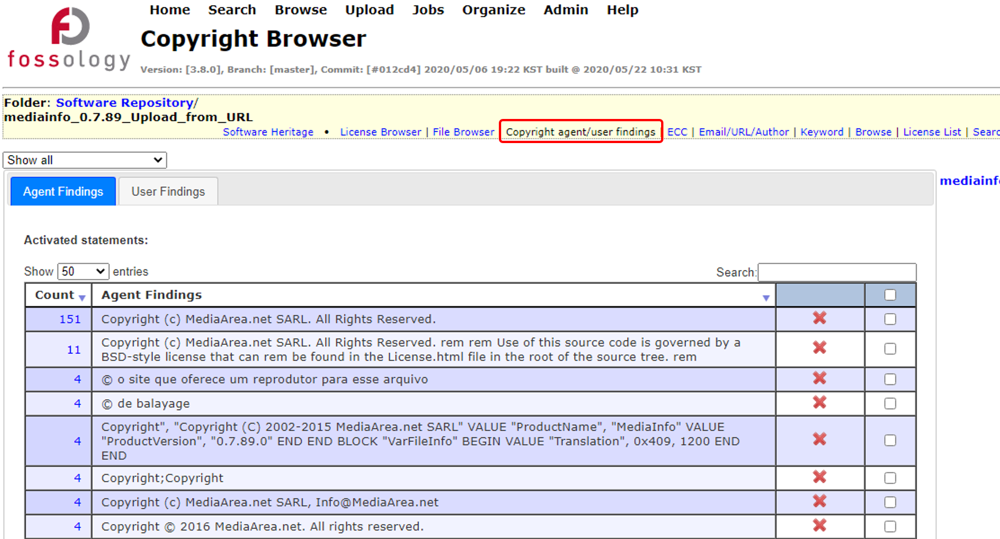

# Scan 결과 확인

## License 검토

### License Browser

```note
Upload 내 경로에 따라 License를 확인할 수 있습니다.
```


1. 상단에서 현재 브라우징 중인 경로를 확인할 수 있습니다.
2. 좌측 테이블에서 각 License 별로 Upload 내에서 검출된 갯수를 확인할 수 있습니다.
3. 우측 테이블에서 각 Directory / File 별로 검출된 License 종류를 확인할 수 있고, Directory를 클릭하여 원하는 경로를 찾아갈 수 있습니다.


- 좌측 테이블에서 License Name을 클릭하거나, 우측 테이블의 Drop Down 메뉴에서 License를 선택하면 해당 License가 사용된 Directory 및 File만이 리스팅 됩니다.

### License List

```note
Project에 포함된 파일별 License 검출 결과를 파일로 다운로드 받을 수 있습니다.
```

#### License List 화면


1. 결과를 확인하고자 하는 Agent를 선택합니다.
  - (Monk와 Nomos 두 가지를 선택하는 것이 권장됩니다.)
2. 검출 결과를 CSV 파일로 다운로드 받도록 체크합니다.
  - (선택하지 않을 경우 결과는 화면에 출력됩니다.)
3. "Generate list" 버튼을 클릭해 결과를 다운로드 받습니다.

#### License List 파일


- 다운로드 받은 CSV 파일에는 1) 파일의 경로, 2) FOSSology로 검출된 License, 3) Clearing을 통해 최종 확인한 License가 포함됩니다.

``` warning
License List에 출력될 파일의 갯수가 최대값을 초과하는 경우 Web UI에서의 출력 및 CSV 파일 다운로드 시 출력이 제한됩니다.
이러한 경우에는 1) Admin > Customize에서 'Maximum licenses to List' 값을 변경하거나, 2) 터미널에서 각 Agent별 분석을 별도로 하여 리스트를 출력해야 합니다.
```

### Copyright / Email / URL / Author

#### Copyright Browser



- 각 Directory에 포함된 Copyright 정보를 확인하실 수 있습니다.


- 각각의 정보에 대해 특정 키워드를 인식하여 보여주기 때문에 False Alarm이 발생할 수 있고, False Alarm 정보는 우측의 X 아이콘을 클릭함으로써 제거 가능합니다.


- False Alarm은 우측 체크박스를 체크 후 "Mark selected rows for deletion" 버튼을 클릭하여 한번에 제거할 수 있습니다.


- 제거된 항목들은 하단의 Deactivated statements 에서 확인할 수 있고, "Undo" 버튼을 클릭하여 다시 삽입 할 수 있습니다.

```note
하나의 Row로 취합


- 저작권자의 이름으로 검색하여, 하나의 Row로 취합할 수 있습니다.
```

### Email / URL / Author Browser


- Email/URL/Author 화면 또한 Copyright 화면과 동일한 방식으로 사용할 수 있습니다.


## SPDX 문서

```note
SPDX (Software Package Data Exchange)는 software package 내 정보 (component, license, copyright)를 교환하는 표준 규격입니다.  [http://spdx.org/](http://spdx.org/)
```


- 드롭다운 메뉴에서 Export SPDX RDF 혹은 Export SPDX tag:value 를 선택합니다.


- SPDX 다운로드 메뉴를 선택하면 자동으로 Show Jobs 화면으로 이동하며, SPDX 문서 생성 Job이 생성됩니다.
SPDX 문서 생성이 완료되면 자동으로 파일 다운로드 링크가 생성되며, 이후 생성된 파일은 Show Jobs 화면에서 다운로드 받을 수 있습니다.

