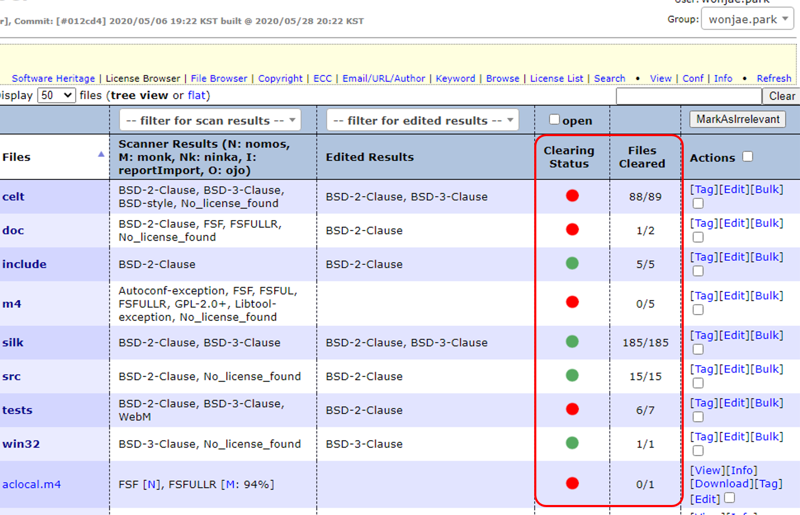

# Clearing

```note
- FOSSology는 분석 대상 Software를 업로드하면서 바로 Scanning을 수행하지만 각 파일들은 Multi/Dual License 이거나 혹은 Scanning 결과에 False Alarm이 있을 수 있습니다.
- 이에, Clearing을 통해 Scanning 결과를 정제하여 보다 더 정확한 정보로 정리할 수 있습니다.
```

## Clearing의 필요성

### Multi License와 Dual License

FOSSology는 String Search를 기반으로 하기에, 하나의 파일에 여러 License의 Keyword가 발견되면, 이를 모두 표기해줍니다. 이러한 경우 사용자는 해당 파일이 Multi License인지 아니면 Dual License인지 판단하여 적절히 Identify 하여야 합니다.

- Multi License : 한 OSS 혹은 File에 여러 License가 적용된 경우. (e.g. The Open Group License AND X11 인 xinit의 사용을 위해서는 The Open Group License와 X11의 요구를 모두 충족해야 함)

- Dual License : 한 OSS 혹은 File이 여러 License 중 하나로 사용할 수 있는 경우. (e.g. BSD-3-Clause OR GPL-2.0인 libcap의 사용을 위해서는 BSD-3-Clause와 GPL-2.0 둘 중 하나의 요구만 충족하면 됨)

### False Alarm

FOSSology는 String Search를 기반으로 하기에, 파일에 포함되어있는 Keyword에 따라 잘못된 License가 검출될 수 있습니다. 이러한 경우 사용자는 잘못 검출된 License를 제거하여야 합니다.

- 예시의 파일(Example_Project.zip/Source/MediaInfo/MediaInfo_Config_Automatic.cpp)의 경우 BSD, GPL 두 가지의 License가 검출되었습니다.
- 하지만, 실제 주석에서는 해당 파일이 BSD-style임이 명시되어있고, Code 내에 String으로 'GNU GPL'이 포함되어 FOSSology에서는 False Alarm이 발생하게 됩니다.


## Clearing 방법

### 파일  단위 Clearing

```note
사용자가 각 파일단위로 직접 Identify 할 수 있습니다.
```


1. 검색된 License 추가 / 삭제
  - User Decision에서 License를 검색하여 추가
  - Action의 추가 버튼 사용하여 License 삭제
2. Clearing Decision Type
  - Identified : License 확인이 완료되었음
  - Irrelevant : Open Source가 사용되지 않은 파일임
3. Submit
  - Clearing 결과를 저장검색된 License 추가 / 삭제

### Bulk Clearing

```note
동일한 Text를 포함하는 모든 File들에 대해 License를 추가 / 삭제 할 수 있습니다.
```


1. License 선택
  - 동작을 취할 License 선택
2. Add/Remove License
  - 선택된 License에 대해 취할 동작 선택
3. Reference Text
  - 검색할 Text 입력
4. Schedule Bulk Scan
  - 1,2,3 에서 지정한 동작을 Job 스케쥴에 추가

## Clearing 결과 확인

### License Browser

```note
License Browse에서는 각 파일의 Clearing 상태를 확인할 수 있습니다.
- Clearing Status : Clearing 완료 여부를 표현합니다. 녹색은 파일 혹은 디렉토리 전체의 Clearing이 완료되었음을, 빨간색은 아직 완료되지 않았음을 뜻합니다.
- Files Cleared : 총 파일 수와 Clearing이 완료된 파일 수를 표현합니다. (완료된 파일 수 / 총 파일 수)
```



### License List

```note
다운로드 받은 License List (CSV 파일)에서 각 파일별 Clearing 결과를 확인할 수 있습니다. ([4. OSS List 작성](4_oss-list.html) 참고)
- file path : 각 파일의 Path
- scan results : FOSSology가 검출한 License
- concluded results : Clearing 결과
```


