# OSS Report 작성
```note
본 페이지에서는 FOSSology를 이용하여 Source Code를 분석한 후 이를 다운로드 받고, [OSS Report](asset_4_oss-report/LGE-OSS-Report_Kor_1.1.xlsx)에 기입하는 방법을 설명하고 있습니다.
```

## 파일 목록을 OSS Report에  복사

- FOSSology에서 다운로드 받은 CSV 파일의 'File Path'를 복사하여 [OSS Report](asset_4_oss-report/LGE-OSS-Report_Kor_1.1.xlsx)의 'Binary Name or (if delivery form is source code) Source Path'에 붙여넣습니다.

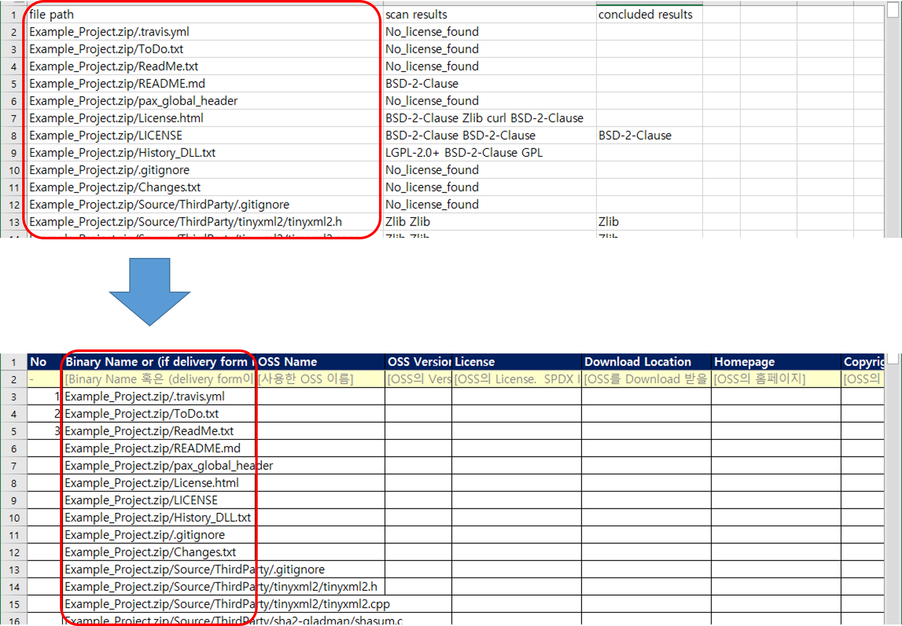

## OSS Report 보완

### License

- License Browser에서는 FOSSology에서 찾은 각 Project의 License 구성내역을 확인할 수 있습니다.
- 좌측에는 검출된 License 목록과, License별 검출 횟수(Scanner Count)가 표현 됩니다. 여기서 Scanner Count를 클릭하면 해당 License가 검출된 파일들의 List가 표현됩니다.

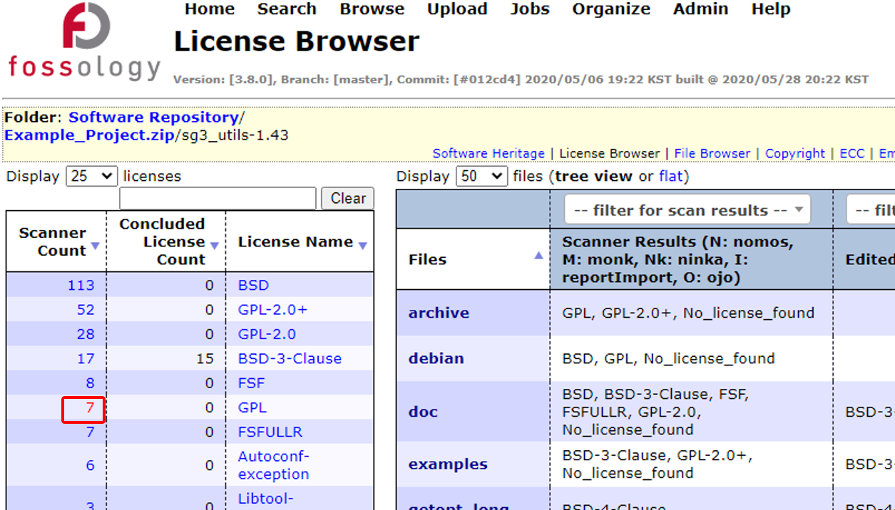

- License가 검출된 파일 List에서, 파일명을 클릭하면 해당 파일 내용을 확인할 수 있습니다.

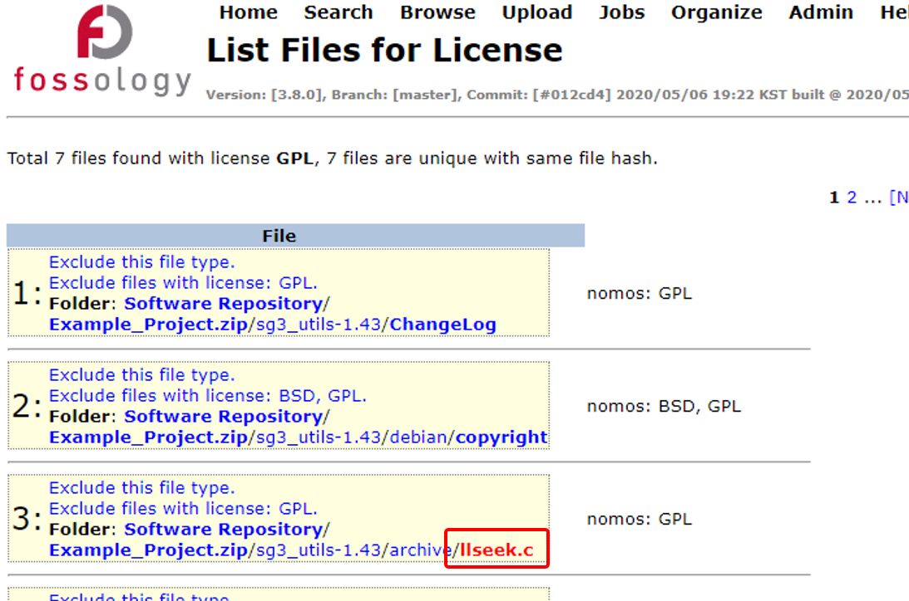

- 파일 상세 화면에서 우측에는 해당 파일에서 검출된 License가 표기되고, License 명 우측의 Source에 표기된 숫자를 클릭하면 어떤 Keyword에 의해 해당 License로 판명되었는지 근거를 확인할 수 있습니다. (예시의 /sg3_utils-1.43/archive/llseek.c 파일은 GPL-2.0임을 확인할 수 있습니다.)

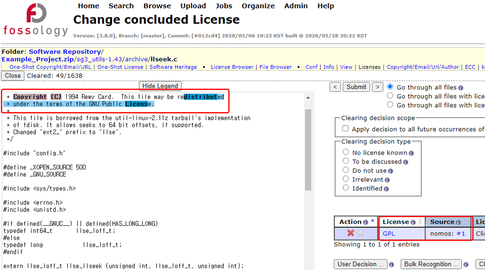

- FOSSology에서 확인한 결과에 따라 License를 [OSS Report](asset_4_oss-report/LGE-OSS-Report_Kor_1.1.xlsx)의 License 열에 작성합니다.
License 열의 dropdown 목록에서 확인된 License를 선택하실 수 있으며, Dropdown 목록에 없는 License는 License Text 열에 License Text를 기입하셔야 합니다.

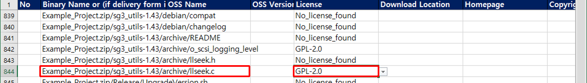

### OSS Name / OSS Version

```tip
각 OSS의 Root 디렉토리를 확인하면 일반적으로 "LICENSE", "NOTICE", "README", "COPYING" 등의 Text 파일에 해당 Software의 이름, 버전, License 등을 표기하고 있습니다.
```

- OSS Name 및 OSS Version은 해당 Source Code 상단에 기술된 정보, Software의 Root 디렉토리에 있는 정보 혹은, 출처에서 명시하고 있는 정보를 이용하여 확인합니다.

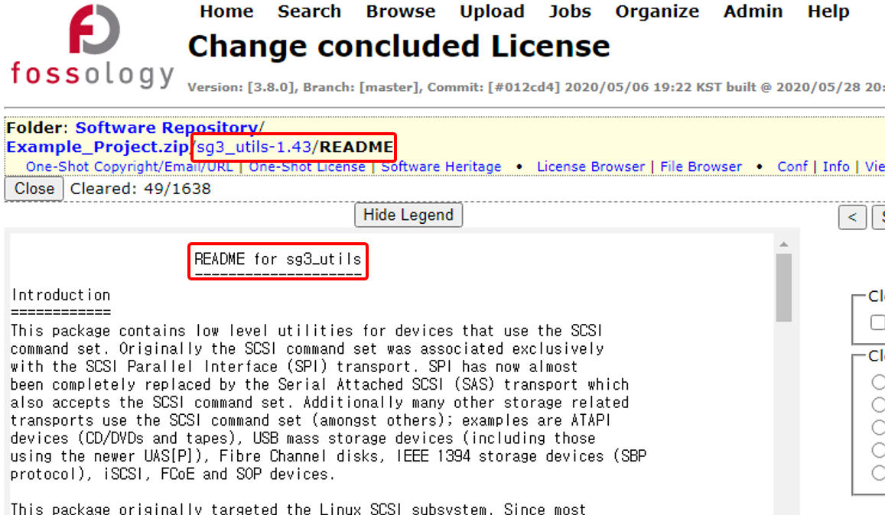
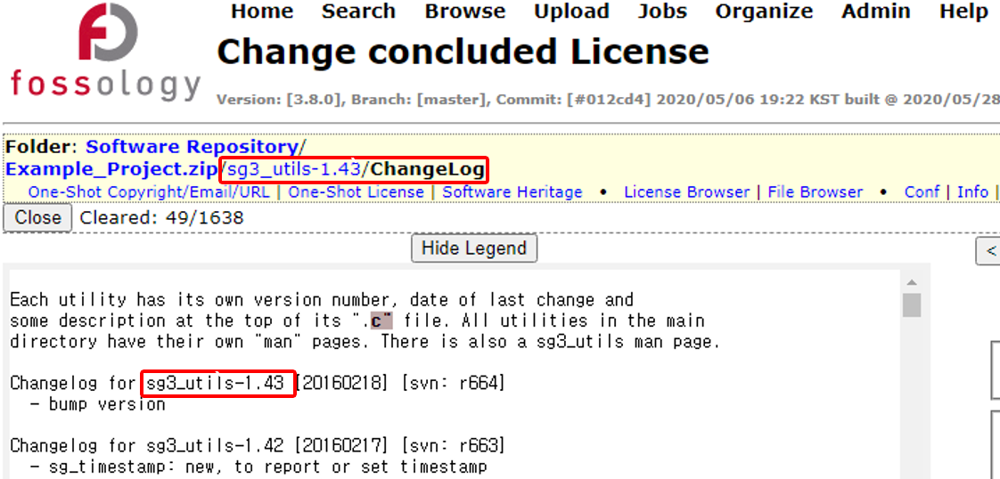

- 확인된 OSS Name 및 OSS Version을 [OSS Report](asset_4_oss-report/LGE-OSS-Report_Kor_1.1.xlsx)에 기입합니다.

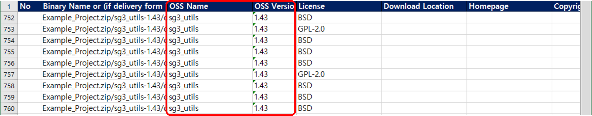

### Download Location / Homepage

- Download Location은 해당 OSS를 다운로드 받을 수 있는 위치를 의미합니다.

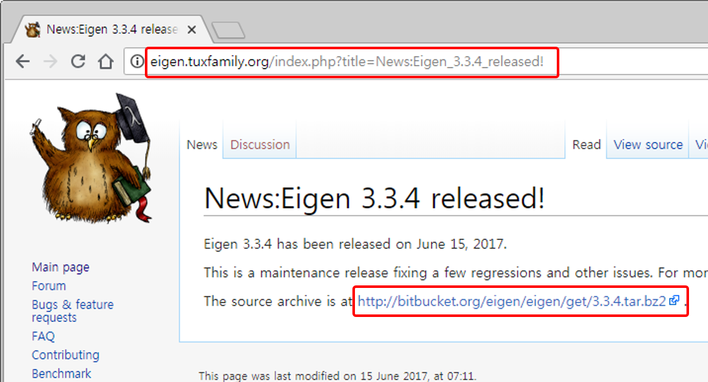

- Homepage는 해당 OSS의 대표 주소를 의미합니다.

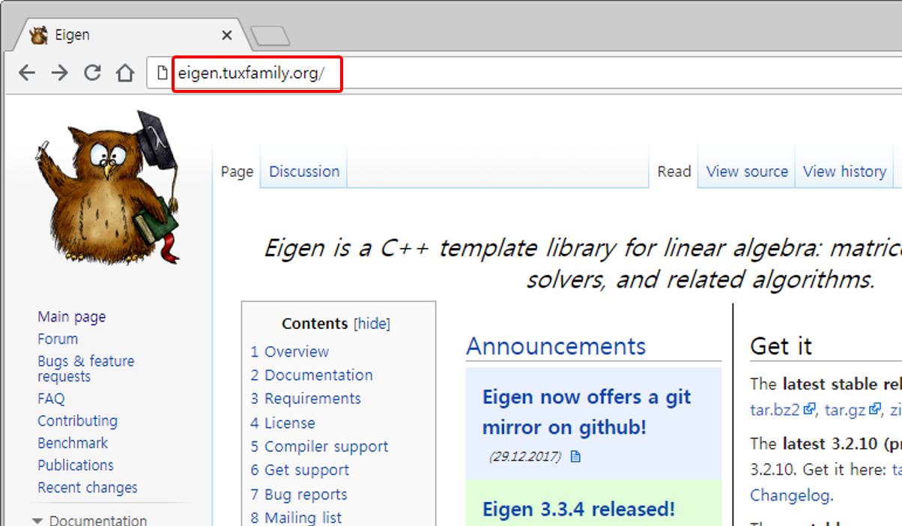

- 확인된 Download Location과 Homelage를 [OSS Report](asset_4_oss-report/LGE-OSS-Report_Kor_1.1.xlsx)에 기입합니다.

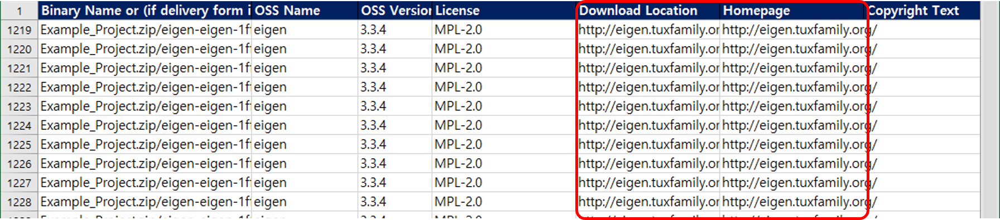

### Copyright Text

- 일반적으로 Copyright Text는 OSS 대표 사이트 혹은 Repository에서 제공되는 Copyright 정보를 사용합니다.

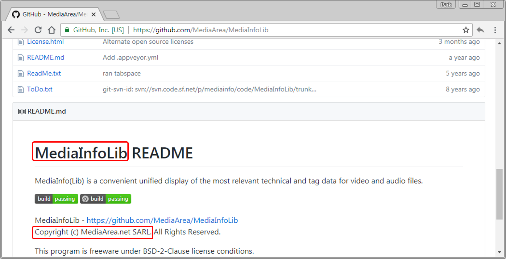

- 단, OSS 전체를 활용하는 것이 아니라 특정 Source Code만이 사용되었을 경우 해당 Copyright Text를 참고합니다.

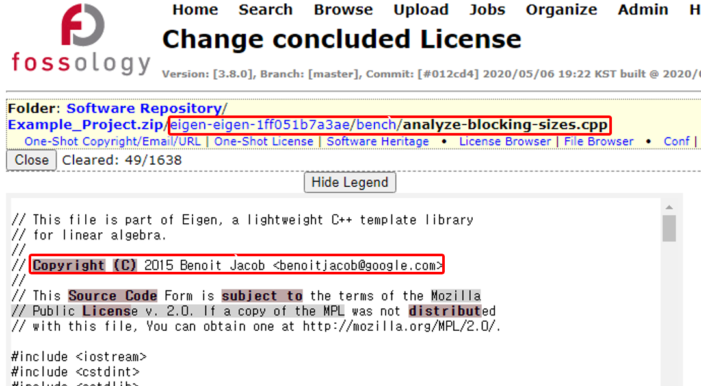

### License Text

- 위의 License 에서 설명한 바와 같이, [OSS Report](asset_4_oss-report/LGE-OSS-Report_Kor_1.1.xlsx)의 License Dropdown 목록에 있는 License들에 대해서는 License Text를 작성하지 않아도 되고, Dropdown 목록에 없다면 License Text를 기입해야 합니다

### False Alarm

- FOSSology는 String Search를 기반으로 하기에, 파일에 포함되어있는 Keyword에 따라 잘못된 License가 검출될 수 있습니다.
예시의 파일(Example_Project.zip/eigen-eigen-1ff051b7a3ae/unsupported/Eigen/FFT)의 경우 MPL, LGPL, GPL 세 가지의 License가 검출되었습니다.
- 하지만, 실제 주석에서는 해당 파일이 MPL-2.0임이 명시되어있고,
- 관련된 별도의 OSS에 대한 설명에 "GPL", "LGPL"이 포함되어 FOSSology에서는 False Alarm이 발생하게 됩니다.

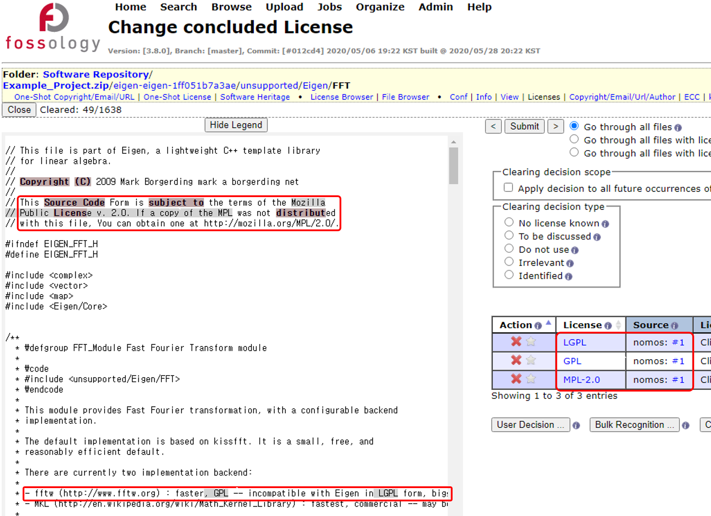

- 이러한 경우 OSS 보고서에는 False Alarm 내역을 제거하고, 실제 사용된 License만을 작성해야합니다.

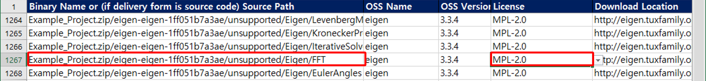

### Folder 별 작성

- 하나의 Directory가 동일한 License의 파일들로 구성되어있다면, OSS 보고서의 한 행에 작성하고, 나머지 행들은 삭제해도 됩니다.(예시 : Example_Project.zip/eigen-eigen-1ff051b7a3ae/bench/btl/actions/)

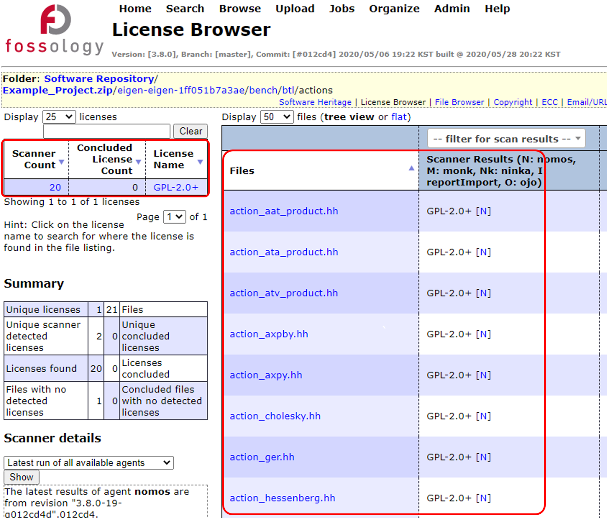
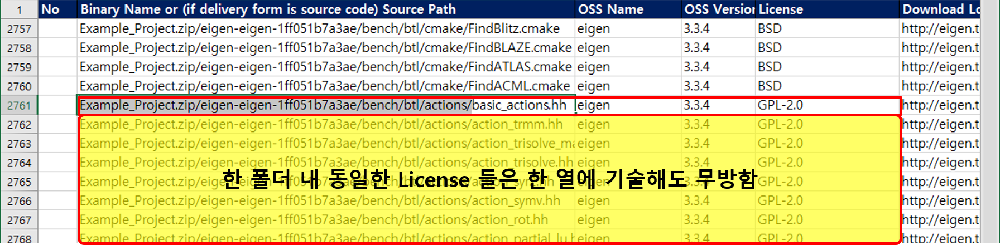

## 분석 제외 대상
- Source Code 디렉토리 내의 파일이라 하더라도 실제 제품에 탑재되지 않는 경우나, 배포 대상이 되지 않는 파일의 경우 분석에서 제외될 수 있습니다.

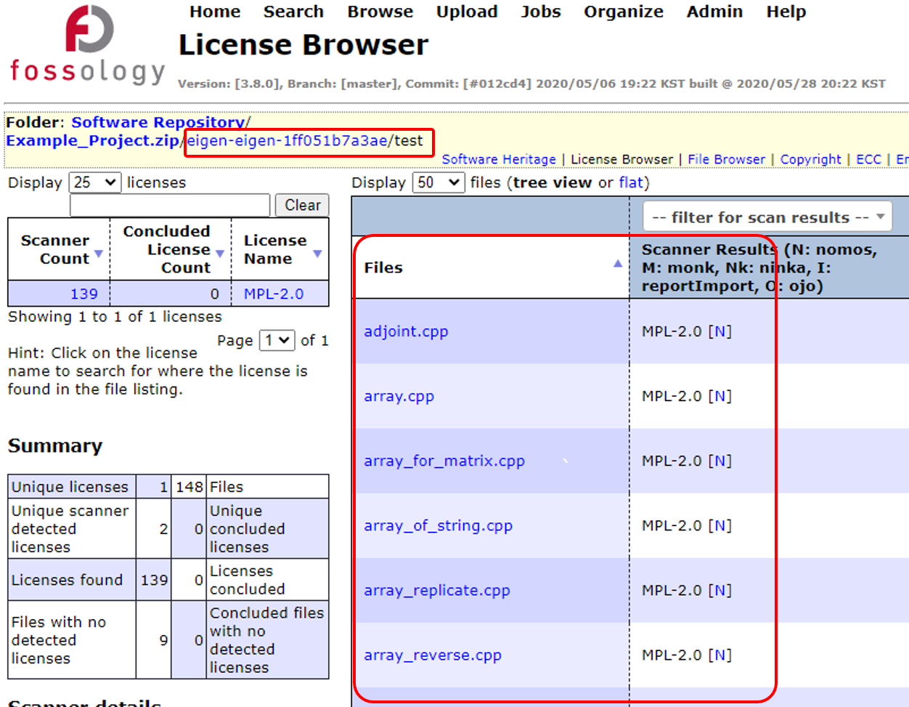